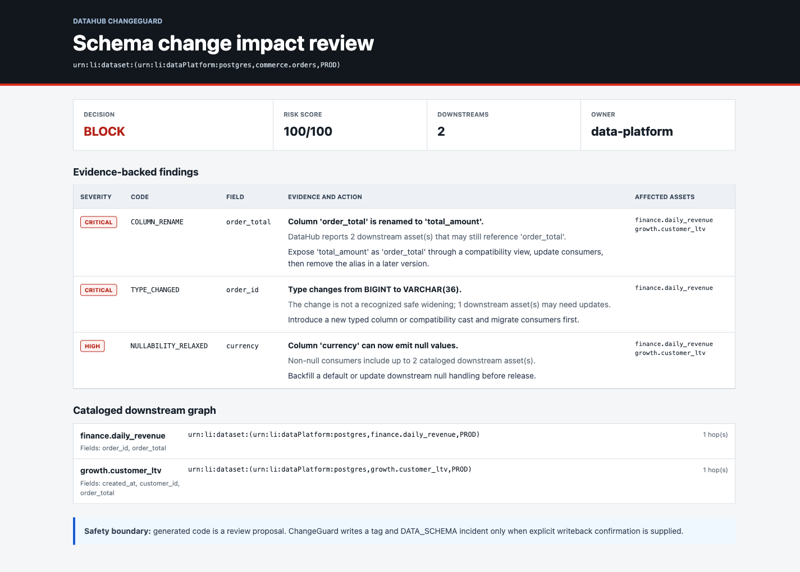
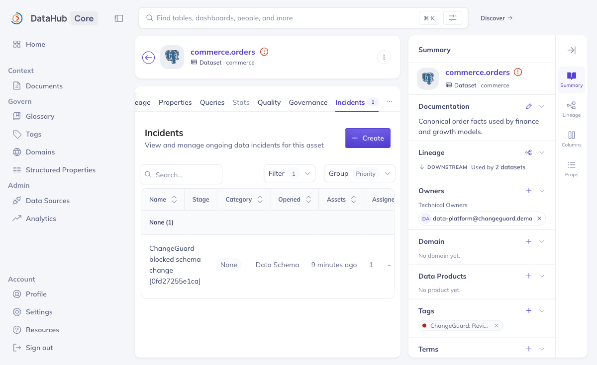
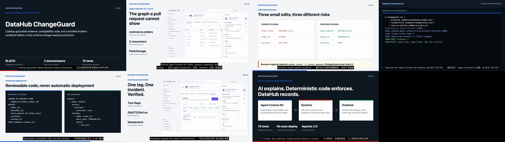

# DataHub ChangeGuard

DataHub ChangeGuard is an agent workflow that reviews a proposed schema change before it reaches production. It uses DataHub's official Agent Context Kit to ground the review in schema, ownership, tags, and downstream lineage, then generates reviewable migration artifacts and records a confirmed `DATA_SCHEMA` incident when the proposal should be blocked.

The project targets two Build with DataHub tracks:

- **Agents That Do Real Work**: collect catalog evidence, decide whether to block, and write the result back.
- **Metadata-Aware Code Generation & Development**: generate compatibility SQL and a dbt contract from real schema and lineage context.

## What it produces

- `audit.json`: deterministic decision, score, findings, evidence, and affected assets.
- `report.md` and `report.html`: human review package.
- `compatibility_view.sql`: backward-compatible rename proposal when every removed field has an explicit mapping.
- `dbt_schema.yml`: proposed dbt model contract and non-null tests.
- `datahub_context.json`: catalog evidence snapshot.
- Optional DataHub review tag and active schema incident, protected by explicit confirmation.

## Architecture

```text
AI assistant / ChangeGuard Skill
             |
             v
official Agent Context Kit tools
get_entities | list_schema_fields | get_lineage
             |
             v
DataHub Core context graph
schema | lineage | ownership | tags
             |
             v
    deterministic analyzer
             |
             +--> audit and report
             +--> compatibility SQL
             +--> dbt contract
             |
             +--> confirmed tag + DATA_SCHEMA incident
```

The live read path calls the Agent Context Kit's `get_entities`, `list_schema_fields`, and
`get_lineage` tools directly. The DataHub Python SDK remains responsible for isolated demo
seeding and explicitly confirmed entity updates; GraphQL is used for auditable incident
creation and read-after-write verification. The composable Agent Skill is in
`skills/datahub-changeguard/SKILL.md`.

## Judge path

The checked-in evidence can be reviewed without credentials or a running service:

1. Open `output/agent-context-example/report.html` to see the final decision and affected assets.
2. Inspect `output/agent-context-example/datahub_context.json` for Agent Context Kit provenance and field lineage.
3. Review `compatibility_view.sql` and `dbt_schema.yml` in the same directory as mergeable remediation proposals.
4. Run the offline command below to reproduce the deterministic `BLOCK 100/100` result.

For an end-to-end live run, follow the DataHub Quickstart, then run `seed-demo`, `run`, and
`verify-writeback` as shown below. `docs/JUDGE_GUIDE.md` maps each judging criterion to a
specific file or command.

## Quick offline demo

Python 3.11 or newer is required.

```bash
python -m venv .venv
.venv/bin/python -m pip install -e '.[dev]'
.venv/bin/changeguard analyze \
  --current examples/current_schema.json \
  --proposed examples/proposed_schema.json \
  --context examples/context.json \
  --rename-hints examples/rename_hints.json \
  --source-relation commerce.orders_v2 \
  --output-dir output/example
```

Open `output/example/report.html` or inspect the generated files directly. Offline mode uses a checked-in evidence fixture and does not contact DataHub.

## Live DataHub demo

Start a DataHub 1.6 instance using the official Quickstart, then configure only environment values:

```bash
cp .env.example .env
set -a; source .env; set +a

.venv/bin/changeguard seed-demo
.venv/bin/changeguard run \
  --proposed examples/proposed_schema.json \
  --rename-hints examples/rename_hints.json \
  --source-relation commerce.orders_v2 \
  --output-dir output/live
```

The `seed-demo` command upserts three datasets under the isolated names `commerce.orders`, `finance.daily_revenue`, and `growth.customer_ltv`, including field lineage. It does not modify warehouse data.

### Explicit writeback

First review the live artifacts. Then, only in an isolated or approved catalog:

```bash
.venv/bin/changeguard run \
  --proposed examples/proposed_schema.json \
  --rename-hints examples/rename_hints.json \
  --source-relation commerce.orders_v2 \
  --output-dir output/live \
  --writeback \
  --confirm-writeback

.venv/bin/changeguard verify-writeback
```

Writeback is idempotent for the same audit fingerprint. It adds `urn:li:tag:changeguard-review-required` and creates one active `DATA_SCHEMA` incident.

## Verified demo

The checked-in example produces a `BLOCK` decision at `100/100` for a risky rename, incompatible type change, and relaxed nullability. The live DataHub Core 1.6 verification used Agent Context Kit 1.6.0.14, found two downstream datasets with field-level lineage, wrote the review tag and one incident, then read both records back.





See `docs/EVIDENCE.md` for the exact commands, hashes, and observed results. Devpost-ready copy is in `SUBMISSION.md`, and the video plan is in `DEMO_SCRIPT.md`.

## Demo video

The primary V3 demo is `output/submission/datahub-changeguard-demo-v3.mp4`. It presents seven
verified scenes at 1920x1080 and 30 fps with local English narration, bilingual captions, a
real Agent Context Kit command run, a live report walkthrough, and normalized audio. The
recording and build run headlessly and do not occupy the desktop:



```bash
.venv/bin/python -m pip install -e '.[video]'
.venv/bin/playwright install chromium
bash video/build_demo_v3.sh
```

The V3 recorder requires a running local DataHub Core 1.6 instance. The static 1080p V2 and
original 720p fallback remain available and can be rebuilt with `video/build_demo_v2.sh` and
`video/build_demo.sh`. All builds use the system `say` voice and the FFmpeg binary supplied by
`imageio-ffmpeg`; none uses external music or stock footage.

## Development

```bash
.venv/bin/python -m pytest
.venv/bin/python -m ruff check .
```

## Safety and limitations

- Generated code is never deployed automatically.
- A rename requires an explicit mapping file.
- Table-only lineage is labeled as potential impact; field lineage is stronger evidence.
- The risk score is a review policy, not a prediction of outage probability.
- DataHub Cloud-only contracts are not required; the demo runs on DataHub Core 1.6.
- The local DataHub Core 1.6 GMS image returned `404` for a standalone `/mcp` endpoint. The verified path instead executes the official Agent Context Kit tool functions directly against an authenticated `DataHubClient`.
- Tokens come from environment configuration and are never written to output artifacts.

## License

Apache License 2.0. See `LICENSE`.
